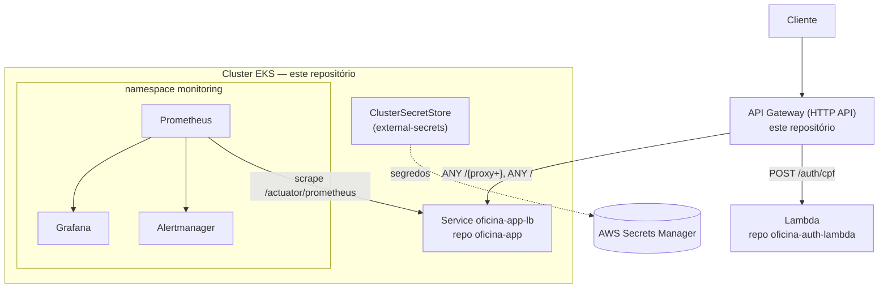

# oficina-infra-k8s

Infraestrutura Kubernetes (Terraform) do projeto Oficina: provisiona o
cluster EKS, o API Gateway de borda, e a stack de observabilidade
(Prometheus/Grafana) compartilhada por todo o cluster. Um dos quatro
repositórios do projeto.

## Propósito

Implementa os requisitos de infraestrutura obrigatória "Cluster Kubernetes
com escalabilidade" e "API Gateway para controle e roteamento", junto com o
requisito de "Monitoramento e Observabilidade" — tudo que é **cluster-wide**,
não específico de uma aplicação. O deploy da aplicação em si (Deployment,
Service, HPA daquele Deployment) vive no repositório `oficina-app`.

## Tecnologias

- Terraform (`hashicorp/aws`) para EKS, VPC e API Gateway (HTTP API)
- Helm (`prometheus-community/kube-prometheus-stack`) para Prometheus +
  Grafana + Alertmanager + node-exporter + kube-state-metrics
- `external-secrets` (ClusterSecretStore) para AWS Secrets Manager

## O que provisiona

- `infra/terraform/modules/eks-cluster` — VPC, subnets, cluster EKS, node
  group.
- `infra/terraform/modules/api-gateway` — API Gateway HTTP API único do
  projeto: rota `POST /auth/cpf` (proxy para o Lambda do repo
  `oficina-auth-lambda`) e rotas `ANY /{proxy+}` / `ANY /` (proxy HTTP para o
  `Service` `oficina-app-lb` do repo `oficina-app`).
- `k8s/observability/` — `ServiceMonitor`, `PrometheusRule` (3 alertas:
  falha de notificação, taxa de erro 5xx alta, app fora do ar) e dashboard
  Grafana (`ConfigMap` com 7 painéis: OS abertas/dia, uptime, falhas de
  notificação, tempo médio por status, latência p95, CPU e memória do pod).
- `k8s/external-secrets/clustersecretstore-aws.yaml` — `ClusterSecretStore`
  usado pelos `ExternalSecret` do repo `oficina-app` (recurso cluster-wide,
  por isso vive aqui e não lá).
- `scripts/install_observability_stack.sh` — instala o
  `kube-prometheus-stack` via Helm e aplica os manifests de
  `k8s/observability/`.

## Deploy

```bash
cd infra/terraform/environments/dev
cp terraform.tfvars.example terraform.tfvars   # preencher os valores
terraform init
terraform apply -var-file=terraform.tfvars
```

`lambda_function_name`/`lambda_invoke_arn` vêm do repositório
`oficina-auth-lambda` (`terraform output -raw lambda_function_name` /
`lambda_invoke_arn` naquele repo). `app_public_url` só é conhecida depois do
deploy do repositório `oficina-app` (hostname do `Service` `oficina-app-lb`)
— use um placeholder no primeiro apply e reaplique com o valor real depois
(ver comentário na própria variável em
`infra/terraform/environments/dev/main.tf`).

Depois que o cluster existir:

```bash
aws eks update-kubeconfig --name <cluster_name> --region <aws_region>
scripts/install_observability_stack.sh
kubectl apply -f k8s/external-secrets/clustersecretstore-aws.yaml
```

Outputs relevantes (`vpc_id`, `subnet_ids`) são consumidos pelo repositório
`oficina-infra-db` para provisionar o RDS na mesma VPC.

CI/CD (GitHub Actions):
- `.github/workflows/plan-infra.yml` — `terraform fmt/validate/plan` +
  scanners de segurança (`tfsec`, `checkov`) em todo PR.
- `.github/workflows/deploy-infra.yml` — disparado manualmente; `apply`
  automático apenas com `terraform_auto_apply=true` (ambiente `production`);
  opcionalmente também instala/atualiza a stack de observabilidade.

Segredos esperados no GitHub: `AWS_REGION`, `AWS_ROLE_TO_ASSUME`,
`EKS_CLUSTER_NAME`, `AUTH_LAMBDA_FUNCTION_NAME`, `AUTH_LAMBDA_INVOKE_ARN`,
`APP_PUBLIC_URL`.

## Arquitetura



## Branch protection

`main` protegida contra push direto; merge somente via Pull Request
(gatilho de `plan-infra.yml`); deploy disparado manualmente após merge, com
`apply` exigindo confirmação explícita e aprovação do ambiente `production`.

## Observação de escopo

Terraform e manifests deste repositório **não foram validados** contra
`terraform`/`kubectl`/`helm` reais (ferramentas indisponíveis no ambiente
onde este repositório foi extraído do monorepo `oficina`) — revisar antes do
primeiro `apply`.
